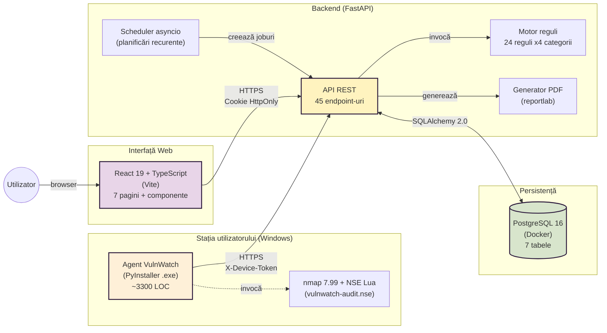
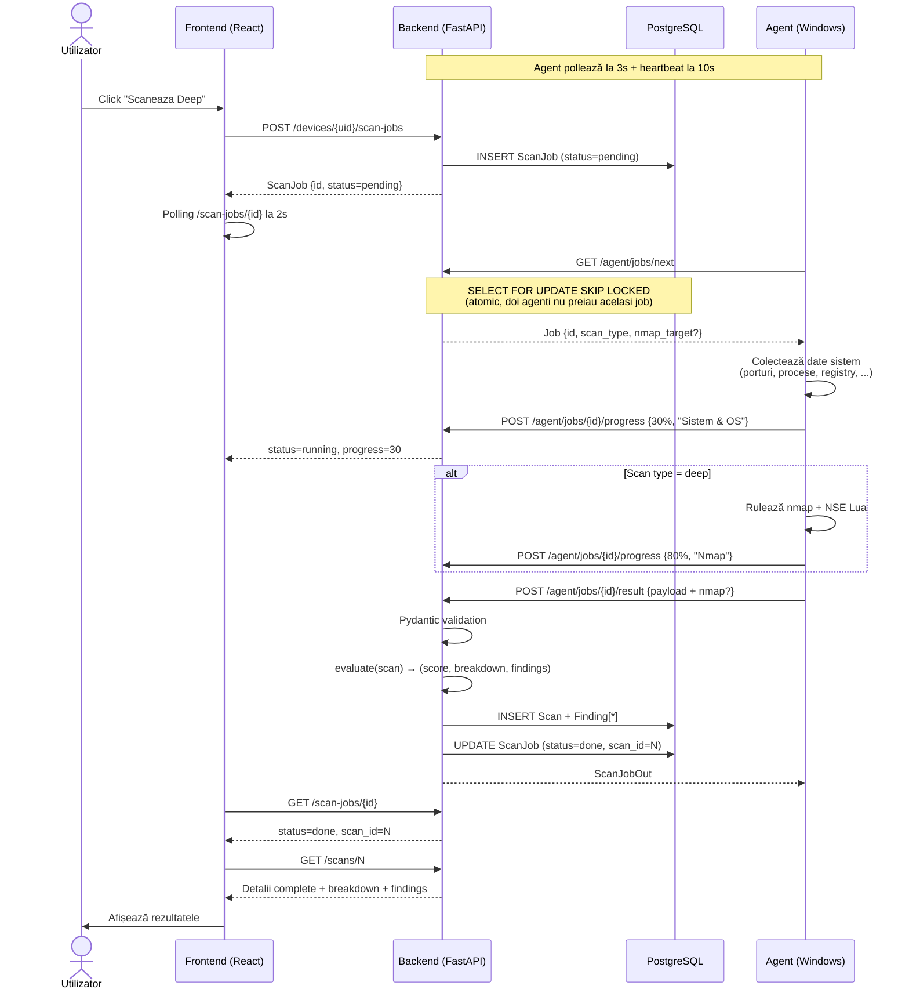
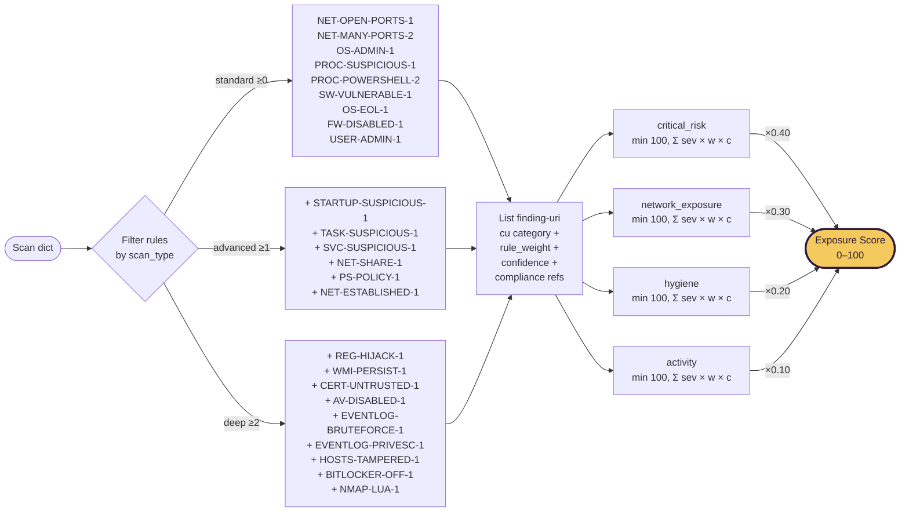
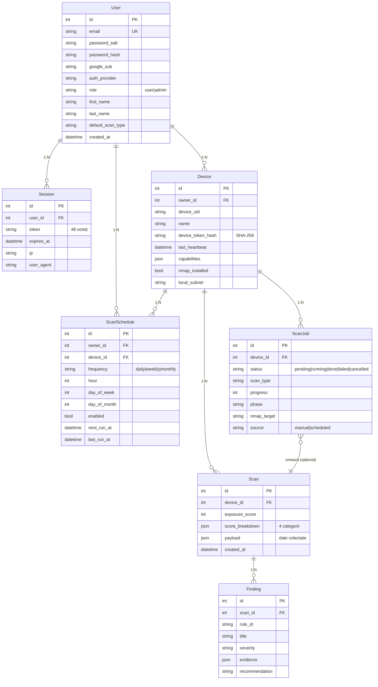
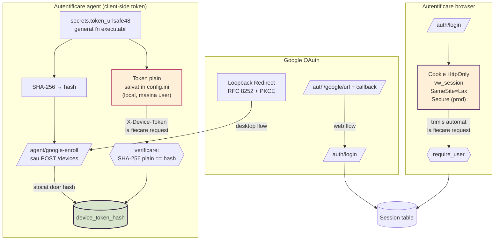

# VulnWatch — arhitectura sistemului

Acest document conține diagramele de referință pentru arhitectura platformei.
Toate sunt scrise în Mermaid și pot fi vizualizate direct pe GitHub sau în
extensia Mermaid Preview pentru VS Code.

## 1. Componente high-level

Trei componente independente comunică exclusiv prin protocolul REST.



**Caracteristici cheie**:
- Agentul nu expune niciun port deschis. Toate conexiunile sunt agent-initiated outbound HTTPS.
- Cele două căi de autentificare (cookie pentru browser, header pentru agent) sunt complet izolate.
- PostgreSQL ascultă exclusiv pe loopback. Accesul extern este blocat la nivel rețea.

---

## 2. Fluxul scan-on-demand

Modelul "pull" prin coadă de joburi. UI cere → Backend creează job → Agent îl preia atomic.



---

## 3. Motor de scoring multidimensional

Scorul final este o agregare ponderată pe 4 categorii ortogonale.



**Formula completă**:

```
sev_weight = {critical: 40, high: 20, medium: 10, low: 3, info: 0}

cat_raw[cat] = Σ sev_weight[f.severity] × f.rule_weight × f.rule_confidence
                for all findings f in category `cat`

breakdown[cat] = min(100, round(cat_raw[cat]))

exposure_score = round(
    0.40 × breakdown.critical_risk +
    0.30 × breakdown.network_exposure +
    0.20 × breakdown.hygiene +
    0.10 × breakdown.activity
)
```

---

## 4. Modelul de date

Șapte tabele cu relații cascadabile (ON DELETE CASCADE).



---

## 5. Stratul de autentificare

Două sisteme de autentificare separate — pentru browser (cookie HttpOnly) și pentru
agent (token client-generated cu hash pe server).



**Observații de securitate**:
- Tokenul de dispozitiv nu părăsește niciodată mașina utilizatorului în formă plain. Compromiterea bazei de date NU oferă acces la dispozitive.
- Cookie-ul de sesiune e HttpOnly — JavaScript nu poate citi tokenul, blocând XSS asupra credențialelor.
- Cele două sisteme sunt complet izolate: un agent compromis nu poate apela endpoint-uri de user, și invers.
